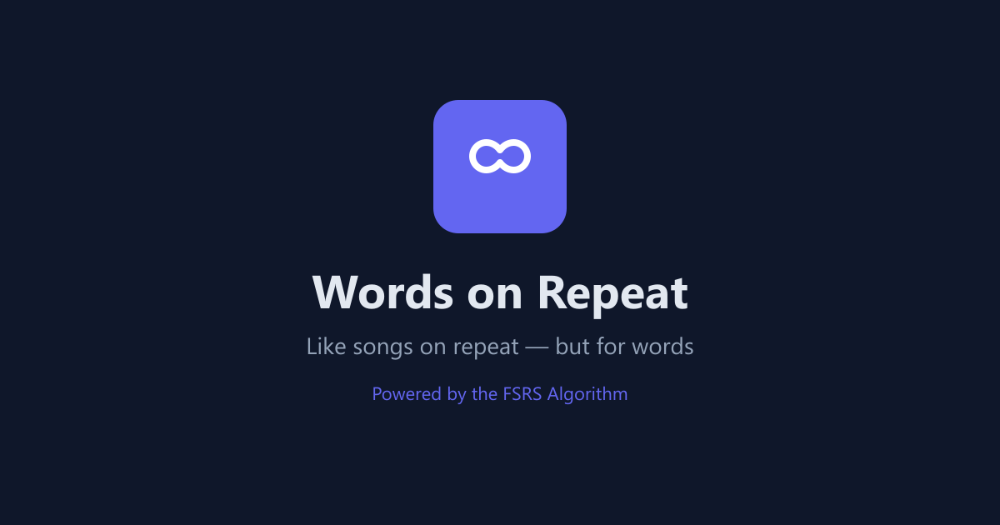
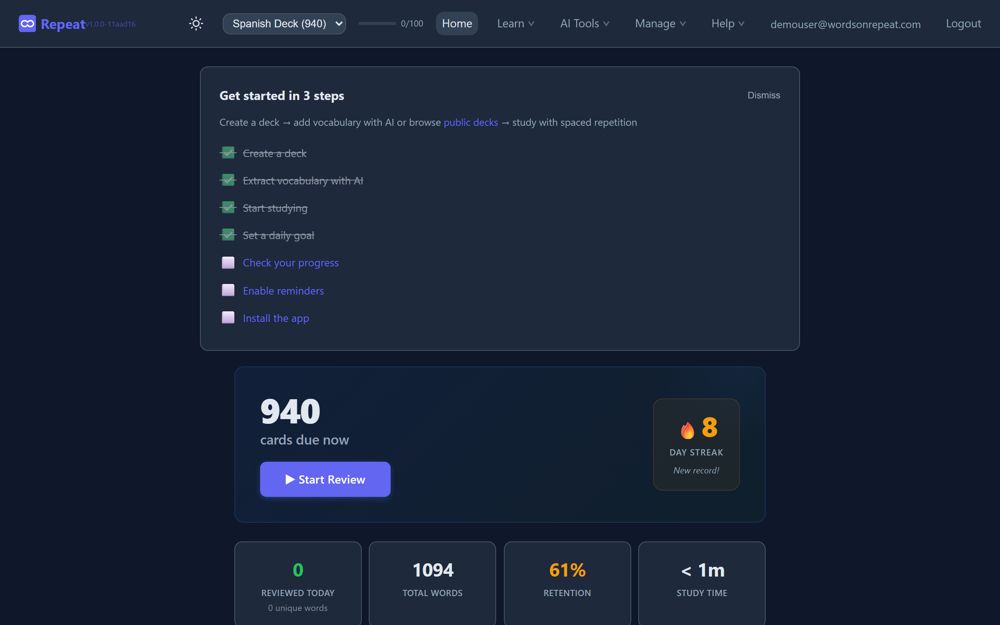
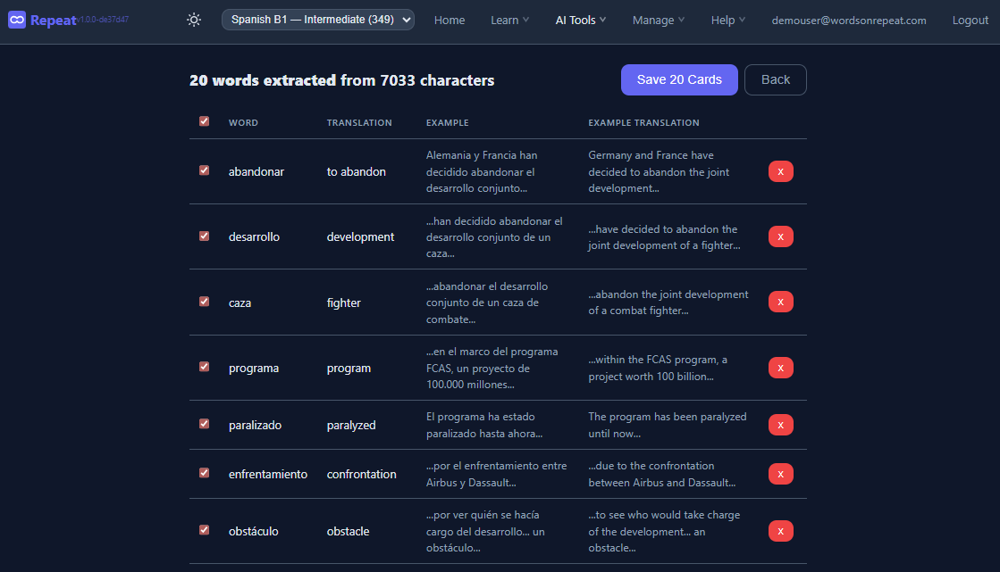
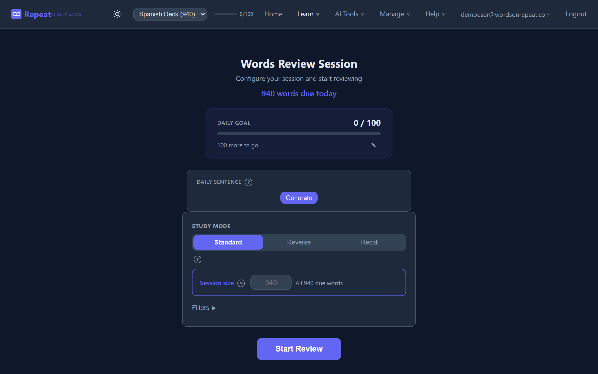
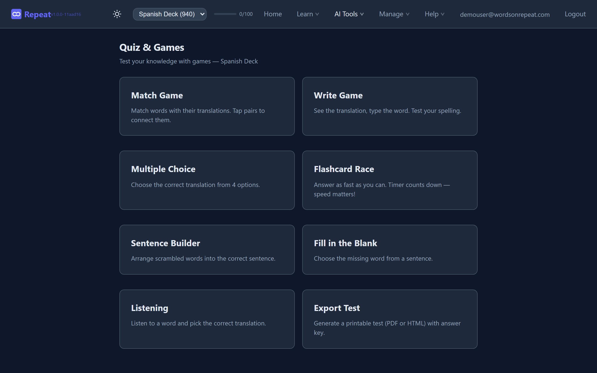
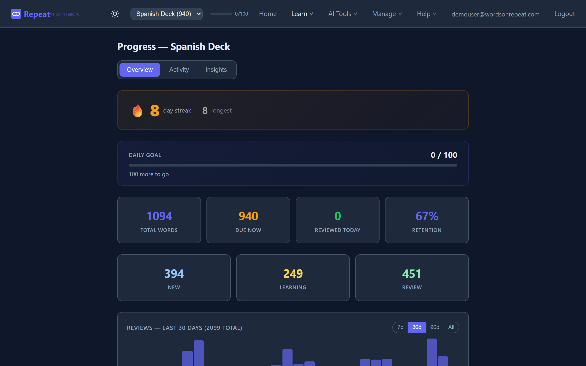
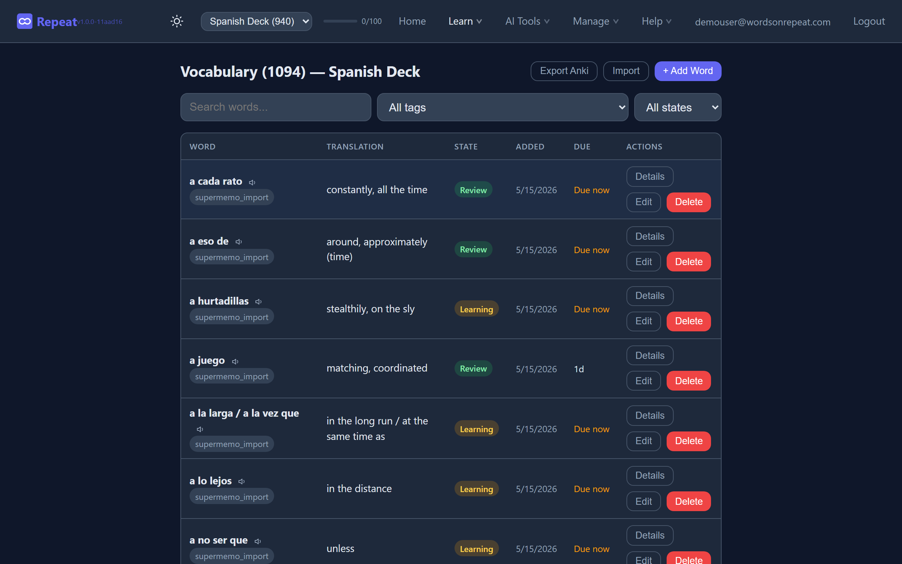
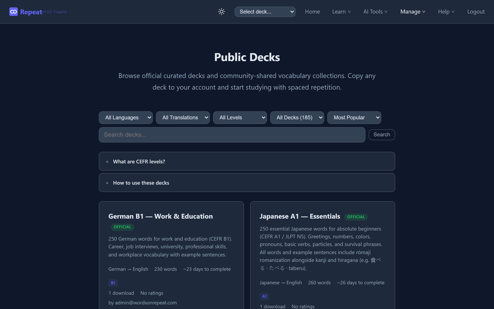

  

<h1 align="center">Words on Repeat</h1>

  <strong>Turn anything you read or watch into vocabulary you'll actually remember.</strong> 
  Powered by AI extraction and the FSRS spaced repetition algorithm.

  <a href="https://wordsonrepeat.com">Website</a> &middot;
  <a href="https://wordsonrepeat.com/blog">Blog</a> &middot;
  <a href="https://wordsonrepeat.com/guide">Guide</a> &middot;
  <a href="https://wordsonrepeat.com/pricing">Pricing</a>

---

## What is Words on Repeat?

Words on Repeat is a vocabulary learning app that uses AI to extract words from any content — URLs, PDFs, pasted text, images, or YouTube subtitles — and turns them into study-ready flashcard decks with translations and example sentences.

The [FSRS spaced repetition algorithm](https://github.com/open-spaced-repetition/ts-fsrs) schedules reviews at optimal intervals based on your memory patterns, so you remember words long-term — not just for a test.

Free to start. No credit card required.

## Screenshots

### Dashboard

  

### AI Vocabulary Extraction

  

### Study Session

  

### Quiz Games

  

### Progress & Analytics

  

### Vocabulary Management

  

### Public Deck Marketplace

  

## Features

### AI-Powered Extraction
- Paste a URL, upload a PDF/image, or paste raw text — AI extracts vocabulary with translations and example sentences
- Import vocabulary directly from YouTube video subtitles
- OCR support for scanned documents and images

### Study & Review
- **FSRS spaced repetition** — adapts to your memory patterns automatically
- **3 study modes:** standard flashcards, reverse (translation → word), recall (type from memory)
- **7 quiz games:** Match, Write, Multiple Choice, Race, Sentence Builder, Fill-in-the-Blank, Listening
- Daily study goals with push notification reminders

### 185+ Curated Decks
- Official vocabulary sets across 12 languages: Spanish, French, German, Italian, Portuguese, Dutch, Polish, English, Japanese, Korean, Chinese, Swiss German
- Full CEFR coverage (A1–C2) with grammar notes and example sentences

### Organization & Sharing
- Multi-deck management — organize vocabulary by topic, source, or level
- Share decks read-only with other learners
- Browse and clone community decks from the public marketplace
- Quizlet import (TSV/CSV) and Anki import/export (.apkg)

### Analytics
- Review heatmap and streak tracking
- Daily, weekly, and monthly study charts
- Per-deck and overall progress statistics

### Works Everywhere
- **Progressive Web App** — install on iOS, Android, or desktop
- Light and dark theme with system preference sync
- Offline study support via service worker caching
- Chrome browser extension
- REST API with 30+ endpoints

## Supported Languages

Any language pair works. Full curated deck coverage for:

| | | | |
|---|---|---|---|
| Spanish | French | German | Italian |
| Portuguese | Dutch | Polish | English |
| Japanese | Korean | Chinese | Swiss German |

## Pricing

| | Free | Pro | Pro Max |
|---|---|---|---|
| Decks | 10 | Unlimited | Unlimited |
| Words | 1,000 | Unlimited | Unlimited |
| AI extractions | 5/month | 5/day | 20/day |
| Study modes & quizzes | All | All | All |
| FSRS spaced repetition | Yes | Yes | Yes |
| Anki import/export | — | Yes | Yes |
| Full analytics & heatmap | — | Yes | Yes |
| API access | — | Yes | Yes |
| Price | **Free** | **$4.99/mo** | **$14.99/mo** |

[See full plan comparison →](https://wordsonrepeat.com/pricing)

## Links

- **Website:** [wordsonrepeat.com](https://wordsonrepeat.com)
- **Blog:** [wordsonrepeat.com/blog](https://wordsonrepeat.com/blog)
- **Guide:** [wordsonrepeat.com/guide](https://wordsonrepeat.com/guide)
- **Public Decks:** [wordsonrepeat.com/public-decks](https://wordsonrepeat.com/public-decks)
